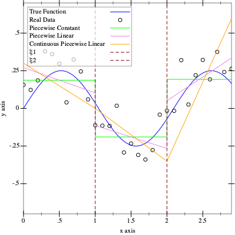
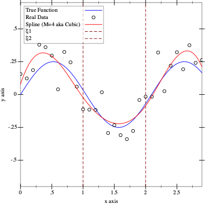

# Learning Regression Methods
My learning notebooks for Regression Methods.

## understanding-neural-networks.ipynb

It's a notebook I did to systematize my understanding of the basic concepts behind neural networks.  
It contains:
- polynomial regression
- idea behind loss function
- backward propagation and gradient descent
- idea behind chain-rule and autodiff

It shows really simple curve-fitting on sin(x) as a true function.  
It then also shows how do the polynomial regression differs from perceptron on sin(x) and on Heaviside function.  

## simple-regression.ipynb

This notebook goes a little bit back to the methods preceeding NNs and gradient descent.  
It contains:
- Least Squares (closed solution)
- k-NN
- basic complexity reduction methods: Subset Selection, Ridge Regularization

## splines.rkt

This is an extension of the notebook above.  
It shows techniques of regressing on non-linear data using *linear basis expansion* in form:

$$
f(X) = \sum_{m=1}^{M} \beta_m h_m(X)
$$

It contains (since racket doesn't have notebooks, attaching visuals):
- Piecewise Constant Regression
- Piecewise Linear Regression
- Continuous Piecewise Linear Regression  

- Cubic Spline  

